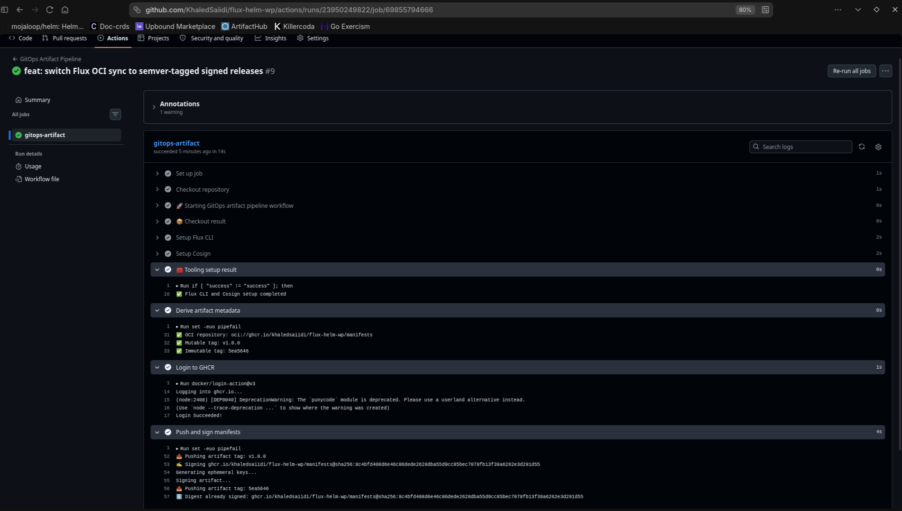
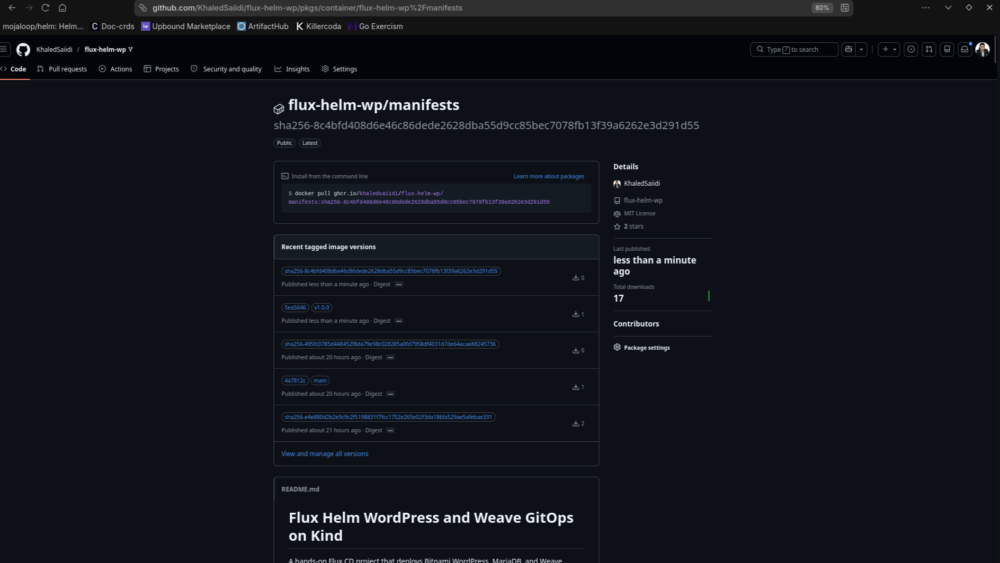
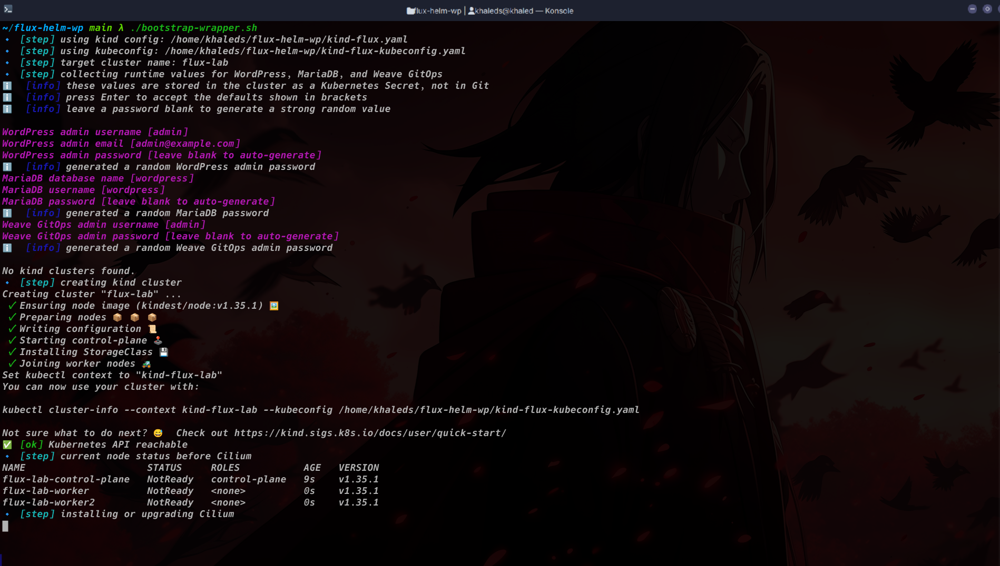
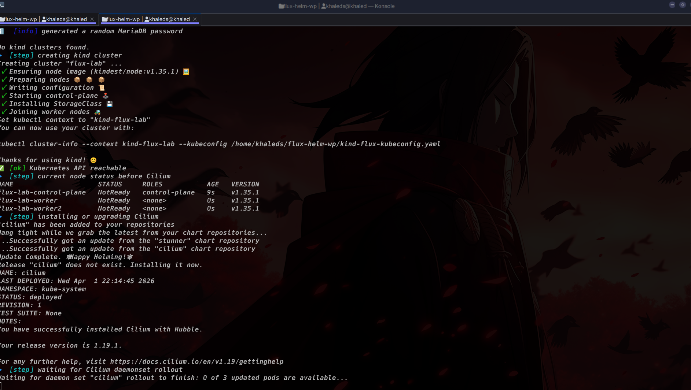
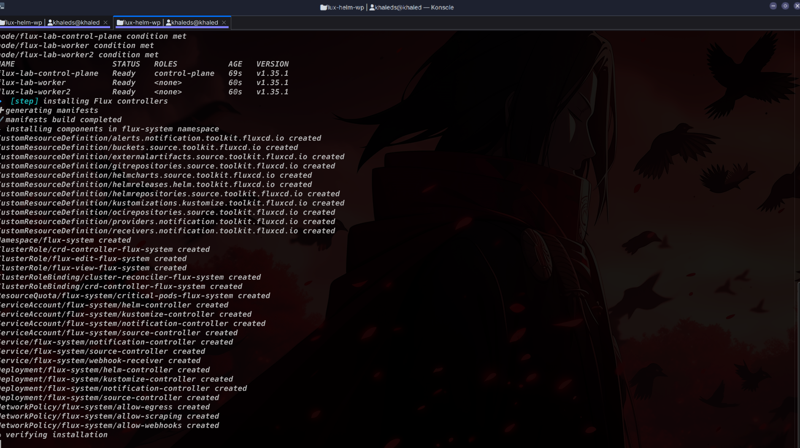
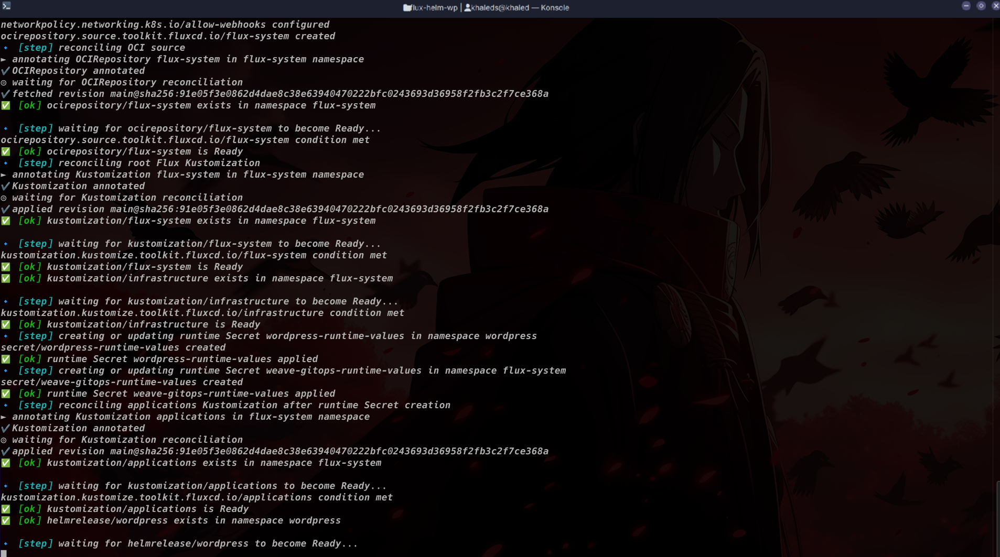
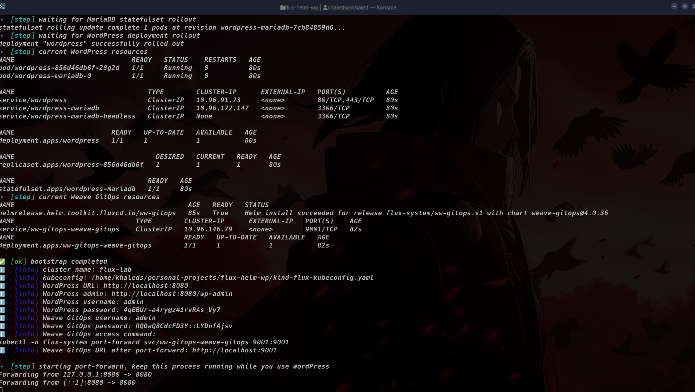
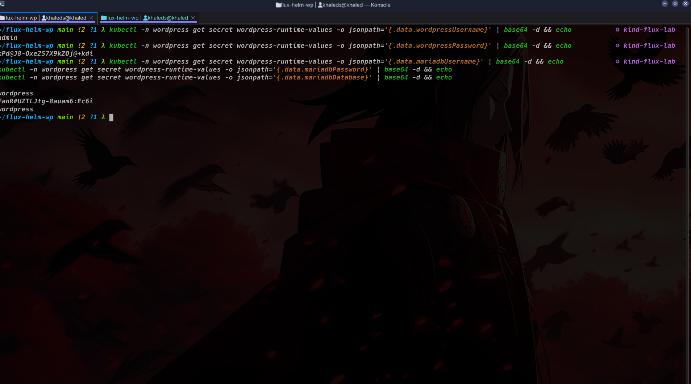
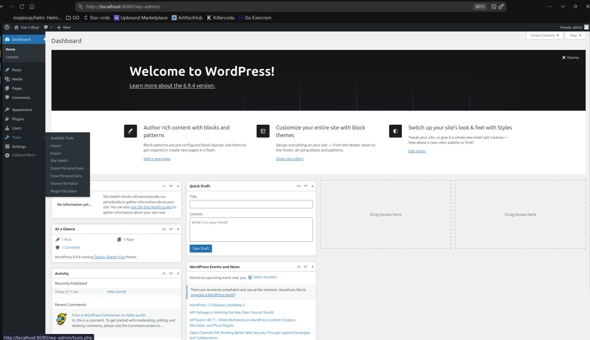

# Flux Helm WordPress and Weave GitOps on Kind

A hands-on Flux CD project that deploys Bitnami WordPress, MariaDB, and Weave GitOps OSS into a local Kind cluster, with Cilium as the CNI, a GitHub Actions pipeline that publishes signed GitOps OCI artifacts to GHCR, and a wrapper script that automates the bootstrap flow.

## What This Repo Does

This repository is a small GitOps lab.

- GitHub Actions packages this repository as a reproducible OCI artifact and pushes it to GHCR.
- GitHub Actions signs that OCI artifact with Cosign using GitHub OIDC.
- Flux watches the OCI artifact in GHCR, not the Git repository directly.
- Flux verifies the OCI artifact signature against the GitHub Actions OIDC identity before reconciliation.
- Flux reconciles the `clusters/production` path from the extracted OCI artifact.
- The infrastructure layer creates the `wordpress` namespace and registers the Bitnami Helm repository.
- The applications layer creates `HelmRelease` objects for WordPress and Weave GitOps OSS.
- The WordPress chart deploys WordPress and MariaDB.
- The Weave GitOps chart deploys a Flux UI on top of the cluster.
- Runtime credentials are not stored in Git. They are injected at bootstrap time into a Kubernetes Secret and consumed by the HelmRelease.

## Architecture

```text
GitHub Repo
   |
   v
GitHub Actions: gitops-artifact-pipeline.yml
   |
   +--> flux push artifact
   +--> cosign sign --yes
   |
   v
GHCR OCI Artifact
oci://ghcr.io/khaledsaiidi/flux-helm-wp/manifests:v1.0.0
   |
   v
Flux OCIRepository (flux-system)
   |
   +--> verify: cosign keyless + GitHub OIDC identity match
   |
   v
Flux Kustomization: flux-system
   |
   +--> Flux Kustomization: infrastructure
   |      +--> Namespace: wordpress
   |      +--> HelmRepository: bitnami
   |
   +--> Flux Kustomization: applications
          +--> HelmRelease: wordpress
                 +--> Bitnami WordPress
                 +--> Bitnami MariaDB
          +--> HelmRelease: ww-gitops
                 +--> Weave GitOps OSS UI

bootstrap-wrapper.sh
   |
   +--> creates or reuses Kind cluster
   +--> installs Cilium
   +--> installs Flux with image automation controllers
   +--> applies OCIRepository + root Kustomization manifests
   +--> creates runtime Secret: wordpress-runtime-values
   +--> creates runtime Secret: weave-gitops-runtime-values
   +--> waits for OCIRepository, Kustomizations, HelmRelease, pods, and rollouts
   +--> starts port-forward to localhost
```

## GitOps Artifact Pipeline

The repository now uses a Flux D2-style delivery path.

1. Developers prepare a release on top of the repository history.
2. A Git tag such as `v1.0.0` is pushed.
3. GitHub Actions runs `.github/workflows/gitops-artifact-pipeline.yml` for that tag.
4. The workflow publishes the repo content as a reproducible OCI artifact to:
   `oci://ghcr.io/khaledsaiidi/flux-helm-wp/manifests`
5. The workflow publishes the release tag, such as `v1.0.0`, and an immutable short-SHA tag for the same artifact.
6. Cosign signs the resulting digest using GitHub OIDC keyless signing.
7. Flux `source-controller` pulls the OCI artifact from GHCR through an `OCIRepository`.
8. Flux selects the highest matching release tag using `ref.semver`.
9. Flux verifies the OCI artifact signature with Cosign keyless verification and checks that the signing identity matches the GitHub Actions tag-based workflow identity.
10. Flux `kustomize-controller` reconciles `./clusters/production` from the extracted artifact only after verification succeeds.

This separates where humans work from what the cluster consumes. The cluster no longer needs direct access to GitHub to deploy the repo state.

Important implication:

- The bootstrap flow applies the initial `OCIRepository` and root `Kustomization` manifests from your local checkout.
- After that, Flux reconciles from the highest matching semver release published at `ghcr.io/khaledsaiidi/flux-helm-wp/manifests`.
- Local-only manifest edits are not deployed until they are committed, released with a Git tag like `v1.0.0`, and the GitHub Action publishes the new OCI artifact.

## Screenshots

### 0. GitHub Actions publishes and signs the GitOps OCI artifact

This shows the `gitops-artifact` workflow succeeding: Flux CLI and Cosign are installed, artifact metadata is derived, the release tag and short-SHA tag are pushed to GHCR, and the digest is signed once with keyless Cosign.



### 0b. GHCR package view for the generated GitOps OCI artifact

This shows the published GHCR package for `flux-helm-wp/manifests`, including release tags, immutable commit tags, and digest-based versions that Flux can pull.



### 1. Wrapper prompts for runtime values and begins cluster creation

This shows the script asking for WordPress and MariaDB values, with support for default values and auto-generated passwords.



### 2. Kind cluster is created and Cilium installation begins

At this stage the nodes are still `NotReady`, which is expected before Cilium finishes installing.



### 3. Flux controllers are installed into `flux-system`

This is the `flux install` phase where Flux CRDs, RBAC, services, and controllers are created.



### 4. Flux OCI source, Kustomizations, and runtime Secret reconciliation

This screenshot shows the OCI source becoming ready, the root and infrastructure Kustomizations succeeding, and the runtime Secret being created before the applications reconcile.



### 5. WordPress and MariaDB become healthy and port-forward starts

This is the successful end state from the wrapper: the HelmRelease is ready, rollouts are complete, resources are listed, and the script prints the admin URL and credentials before starting port-forward.



### 6. Retrieve WordPress and MariaDB credentials from the runtime Secret

This shows the exact `kubectl` commands used to recover the values later, including auto-generated passwords.



### 7. Weave GitOps OSS applications view after login

This shows the Weave GitOps OSS dashboard after port-forwarding `svc/ww-gitops-weave-gitops` on port `9001` and logging in with the values stored in `weave-gitops-runtime-values`. It gives you a Flux-focused UI view of Kustomizations, sources, and application health.



### 8. WordPress admin dashboard after login

This is the WordPress admin dashboard after visiting `/wp-admin` and logging in with the values stored in `wordpress-runtime-values`.


### You forgot the generated password

Recover it from the runtime Secret:

```bash
kubectl -n wordpress get secret wordpress-runtime-values -o jsonpath='{.data.wordpressPassword}' | base64 -d && echo
```

## Repository Layout

```text
.
├── applications/
│   ├── kustomization.yaml
│   └── wordpress/
│       ├── helmrelease.yaml
│       └── kustomization.yaml
├── .github/
│   └── workflows/
│       └── gitops-artifact-pipeline.yml
├── assets/
│   ├── image-0-action.png
│   ├── image-0-package.png
│   ├── image-1.png
│   ├── image-2.png
│   ├── image-3.png
│   ├── image-4.png
│   ├── image-5.png
│   ├── image-6.png
│   ├── image-7.png
│   └── image-8.png
├── bootstrap-wrapper.sh
├── clusters/
│   └── production/
│       ├── applications.yaml
│       ├── flux-system/
│       │   ├── gotk-components.yaml
│       │   ├── gotk-sync.yaml
│       │   └── kustomization.yaml
│       ├── infrastructure.yaml
│       └── kustomization.yaml
├── infrastructure/
│   ├── kustomization.yaml
│   ├── namespace-wordpress.yaml
│   └── sources/
│       └── helmrepository-bitnami.yaml
├── kind-flux.yaml
└── README.md
```

## Current Deployment Model

### Cluster

- Local Kubernetes via Kind
- Cluster name defaults to `flux-lab`
- Default CNI is disabled in `kind-flux.yaml`
- Cilium is installed by the wrapper

### Flux

- Flux is installed with `flux install --components-extra image-reflector-controller,image-automation-controller`
- Flux reads the public OCI artifact from GHCR through an `OCIRepository`
- Flux verifies the OCI artifact with `verify.provider: cosign`
- Flux selects the highest matching OCI release tag with `ref.semver: ">=1.0.0"`
- Flux only accepts signatures issued by GitHub Actions OIDC for `.github/workflows/gitops-artifact-pipeline.yml` on release tags matching `v*.*.*`
- Flux sync starts from `clusters/production` inside the extracted OCI artifact
- The root source is `oci://ghcr.io/khaledsaiidi/flux-helm-wp/manifests`
- The current tracked release range is `>=1.0.0`
- Weave GitOps OSS is deployed as another Flux-managed HelmRelease in `flux-system`

### GitHub Actions and GHCR

- `.github/workflows/gitops-artifact-pipeline.yml` runs on pushes to semver-style Git tags such as `v1.0.0`
- Manual `workflow_dispatch` is kept, but the job only runs when the selected ref is a release tag starting with `v`
- The workflow uses the built-in `GITHUB_TOKEN` with `packages: write`; no PAT is required
- The workflow publishes the GitOps artifact to GHCR in the same repository namespace
- The workflow signs the published digest with Cosign keyless signing using GitHub OIDC
- The GHCR package is public in this project, so Flux can pull it without a registry secret

### Signature Verification

The root `OCIRepository` in `clusters/production/flux-system/gotk-sync.yaml` uses Flux Cosign verification with GitHub Actions OIDC identity matching.

That means the cluster trusts the GitOps artifact only when all of the following are true:

- the artifact is present in `ghcr.io/khaledsaiidi/flux-helm-wp/manifests`
- the artifact has a valid Cosign signature
- the signature was issued through GitHub's OIDC issuer: `https://token.actions.githubusercontent.com`
- the signing identity matches this workflow on this repository:
  `.github/workflows/gitops-artifact-pipeline.yml`
- the signing identity came from a release tag matching `v*.*.*`

In other words, signing in CI is not just informational anymore. Flux enforces that verification before applying the artifact content.

### Credentials

- WordPress, MariaDB, and Weave GitOps credentials are not hardcoded in Git anymore
- `applications/wordpress/helmrelease.yaml` reads them from a Kubernetes Secret using `valuesFrom`
- `applications/weave-gitops/helmrelease.yaml` reads Weave GitOps admin values from a Kubernetes Secret using `valuesFrom`
- The wrapper creates these Secrets as `wordpress-runtime-values` and `weave-gitops-runtime-values`
- If you leave passwords blank during bootstrap, the wrapper auto-generates them

## Prerequisites

Install these tools before running anything:

`docker`, `kind`, `kubectl`, `helm`, `flux`, `gitops`, `awk` and `tr`

The wrapper checks the required CLIs at startup and exits with a clear error if one is missing.

## Recommended Quick Start

The recommended path is the wrapper script.

```bash
git clone https://github.com/KhaledSaiidi/flux-helm-wp.git
cd flux-helm-wp
chmod +x bootstrap-wrapper.sh
./bootstrap-wrapper.sh
```

Before running the wrapper against a fresh repository state, make sure the GitHub Actions artifact pipeline has successfully published the current manifests to GHCR. The cluster now pulls from OCI, not from your local Git checkout after bootstrap.

What the wrapper does:

1. Prompts for WordPress, MariaDB, and Weave GitOps runtime values.
2. Creates the Kind cluster from `kind-flux.yaml`, or reuses it if it already exists.
3. Exports or uses the kubeconfig file.
4. Installs or upgrades Cilium.
5. Waits for all nodes to become `Ready`.
6. Installs Flux controllers.
7. Applies `clusters/production/flux-system`.
8. Reconciles the OCI source and Flux Kustomizations.
9. Creates the runtime Secret in the `wordpress` namespace.
10. Creates the runtime Secret for Weave GitOps in `flux-system`.
11. Reconciles the applications layer.
12. Waits for the WordPress and Weave GitOps HelmReleases, plus MariaDB and WordPress workloads, to become healthy.
13. Prints the final access information, including the Weave GitOps port-forward command.
14. Starts `kubectl port-forward` for WordPress in the foreground.

## Interactive Inputs

During bootstrap, the wrapper prompts for:

- WordPress admin username
- WordPress admin email
- WordPress admin password
- MariaDB database name
- MariaDB username
- MariaDB password
- Weave GitOps admin username
- Weave GitOps admin password

Behavior:

- Press `Enter` to accept the defaults shown in brackets.
- Leave either password blank to auto-generate a strong random password.
- These values are stored in-cluster as a Kubernetes Secret, not in Git.

## Exportable Environment Variables

The wrapper supports these environment variables:

| Variable | Default | Purpose |
|---|---|---|
| `KIND_CONFIG` | `./kind-flux.yaml` | Path to the Kind cluster config file |
| `KUBECONFIG_PATH` | `./kind-flux-kubeconfig.yaml` | Path where the wrapper stores or uses the kubeconfig |
| `CLUSTER_NAME` | parsed from `kind-flux.yaml` | Name of the Kind cluster |
| `CILIUM_VERSION` | `1.19.1` | Cilium chart version to install |
| `WORDPRESS_NAMESPACE` | `wordpress` | Namespace where WordPress is deployed |
| `LOCAL_PORT` | `8080` | Local port used for port-forward |
| `REMOTE_PORT` | `80` | Service port forwarded from the WordPress service |
| `WAIT_INTERVAL` | `5` | Poll interval in seconds for wait loops |
| `WORDPRESS_SECRET_NAME` | `wordpress-runtime-values` | Name of the runtime Secret created by the wrapper |
| `WEAVE_GITOPS_SECRET_NAME` | `weave-gitops-runtime-values` | Name of the Weave GitOps runtime Secret |
| `WEAVE_GITOPS_LOCAL_PORT` | `9001` | Local port to use when port-forwarding Weave GitOps |
| `WEAVE_GITOPS_REMOTE_PORT` | `9001` | Service port exposed by the Weave GitOps service |
| `WEAVE_GITOPS_SERVICE_NAME` | `ww-gitops-weave-gitops` | Service name used for Weave GitOps port-forward |

Examples:

```bash
LOCAL_PORT=9090 ./bootstrap-wrapper.sh
```

```bash
KUBECONFIG_PATH=$PWD/my-kind-kubeconfig.yaml ./bootstrap-wrapper.sh
```

```bash
CILIUM_VERSION=1.19.2 ./bootstrap-wrapper.sh
```

## Manual Flow

If you want to run the steps manually instead of the wrapper, this is the flow the repo currently expects.

### 1. Create the Kind cluster

```bash
kind create cluster \
  --config kind-flux.yaml \
  --kubeconfig kind-flux-kubeconfig.yaml
```

### 2. Export kubeconfig

```bash
export KUBECONFIG=$PWD/kind-flux-kubeconfig.yaml
kubectl get nodes
```

At this point, nodes will usually be `NotReady` because `disableDefaultCNI: true` is set.

### 3. Install Cilium

```bash
helm repo add cilium https://helm.cilium.io/
helm repo update
helm upgrade --install cilium cilium/cilium \
  --version 1.19.1 \
  --namespace kube-system \
  --create-namespace \
  --set image.pullPolicy=IfNotPresent \
  --set ipam.mode=kubernetes
```

Wait for Cilium and nodes:

```bash
kubectl -n kube-system rollout status ds/cilium --timeout=300s
kubectl -n kube-system rollout status deploy/cilium-operator --timeout=300s
kubectl wait --for=condition=Ready nodes --all --timeout=300s
kubectl get nodes
```

### 4. Install Flux

```bash
flux install --components-extra image-reflector-controller,image-automation-controller
kubectl apply -k clusters/production/flux-system
```

### 5. Wait for the source and Kustomizations

```bash
flux reconcile source oci flux-system
flux reconcile kustomization flux-system

flux get sources oci -A
flux get kustomizations -A
```

### 6. Create runtime credentials Secret

Create the Secret in the `wordpress` namespace before reconciling the applications layer:

```bash
kubectl create namespace wordpress --dry-run=client -o yaml | kubectl apply -f -
kubectl create secret generic wordpress-runtime-values \
  -n wordpress \
  --from-literal=wordpressUsername=admin \
  --from-literal=wordpressPassword=admin \
  --from-literal=wordpressEmail=admin@example.com \
  --from-literal=mariadbDatabase=wordpress \
  --from-literal=mariadbUsername=wordpress \
  --from-literal=mariadbPassword=wordpress \
  --dry-run=client -o yaml \
  | kubectl label --local -f - reconcile.fluxcd.io/watch=Enabled -o yaml \
  | kubectl apply -f -
```

### 7. Reconcile applications

```bash
flux reconcile kustomization applications
flux get helmreleases -A
kubectl get pods -n wordpress -w
```

### 8. Access WordPress

```bash
kubectl port-forward -n wordpress svc/wordpress 8080:80
```

Then open:

- Site: `http://localhost:8080`
- Admin: `http://localhost:8080/wp-admin`

## Runtime Secret and Credentials

The runtime Secret is:

```text
wordpress-runtime-values
```

The wrapper stores:

- `wordpressUsername`, `wordpressPassword` and `wordpressEmail`
- `mariadbDatabase`, `mariadbUsername` and `mariadbPassword`

Retrieve the current values with:

```bash
kubectl -n wordpress get secret wordpress-runtime-values -o jsonpath='{.data.wordpressUsername}' | base64 -d && echo
kubectl -n wordpress get secret wordpress-runtime-values -o jsonpath='{.data.wordpressPassword}' | base64 -d && echo
kubectl -n wordpress get secret wordpress-runtime-values -o jsonpath='{.data.mariadbUsername}' | base64 -d && echo
kubectl -n wordpress get secret wordpress-runtime-values -o jsonpath='{.data.mariadbPassword}' | base64 -d && echo
kubectl -n wordpress get secret wordpress-runtime-values -o jsonpath='{.data.mariadbDatabase}' | base64 -d && echo
```

This is especially useful if you chose auto-generated passwords.

Weave GitOps admin values are stored in:

```text
weave-gitops-runtime-values
```

Retrieve them with:

```bash
kubectl -n flux-system get secret weave-gitops-runtime-values -o jsonpath='{.data.adminUserUsername}' | base64 -d && echo
kubectl -n flux-system get secret weave-gitops-runtime-values -o jsonpath='{.data.adminUserPassword}' | base64 -d && echo
```

## How the HelmRelease Uses the Secret

`applications/wordpress/helmrelease.yaml` now uses `valuesFrom` so that the chart reads credentials from the Secret instead of storing them inline in Git.

This keeps the repository cleaner and avoids committing admin and database passwords into a public repo.

## Common Day 2 Commands

### Check OCI source and Flux status

```bash
flux get sources oci -A
flux get kustomizations -A
flux get helmreleases -A
```

### Force reconciliation

```bash
flux reconcile source oci flux-system
flux reconcile kustomization infrastructure
flux reconcile kustomization applications
```

### Inspect WordPress resources

```bash
kubectl get all -n wordpress
kubectl get secret -n wordpress wordpress-runtime-values
kubectl logs -n wordpress deploy/wordpress
```

### Access WordPress

```bash
kubectl port-forward -n wordpress svc/wordpress 8080:80
```

### Access Weave GitOps OSS

```bash
kubectl -n flux-system port-forward svc/ww-gitops-weave-gitops 9001:9001
```

Then open `http://localhost:9001`.

### Log in to WordPress admin

Open:

```text
http://localhost:8080/wp-admin
```

Then use the username and password stored in `wordpress-runtime-values`.

## Troubleshooting

### The wrapper says a command is missing

Install the missing CLI and run the script again.

### Nodes stay `NotReady`

Check Cilium first:

```bash
kubectl -n kube-system get pods
kubectl -n kube-system rollout status ds/cilium --timeout=300s
kubectl -n kube-system rollout status deploy/cilium-operator --timeout=300s
kubectl get nodes
```

### Flux source is not ready

```bash
flux get sources oci -A
kubectl -n flux-system describe ocirepository flux-system
kubectl -n flux-system logs deploy/source-controller --tail=100
```

If the OCI source still does not become ready, verify that:

- `ghcr.io/khaledsaiidi/flux-helm-wp/manifests:main` exists
- a matching semver release such as `ghcr.io/khaledsaiidi/flux-helm-wp/manifests:v1.0.0` exists
- the package is public, or you configured a pull secret
- the GitHub Actions pipeline published the latest digest successfully

### Applications are not reconciling

Make sure the runtime Secret exists:

```bash
kubectl -n wordpress get secret wordpress-runtime-values
flux get kustomizations -A
flux get helmreleases -A
```

### WordPress is up but you cannot access it

Make sure the wrapper is still running, or start port-forward manually:

```bash
kubectl port-forward -n wordpress svc/wordpress 8080:80
```

Then open `http://localhost:8080`.

## Notes

- This repo is for learning and local experimentation.
- The current secret flow is much better than hardcoding passwords in Git, but it is still a local bootstrap pattern, not full production secret management.
- The cluster no longer reconciles directly from GitHub; it reconciles from the OCI artifact published to GHCR.
- For a stronger production approach, look at SOPS, External Secrets Operator, or another real secret backend.

## License

MIT
